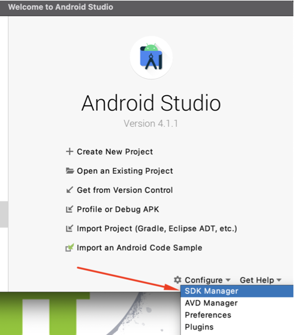
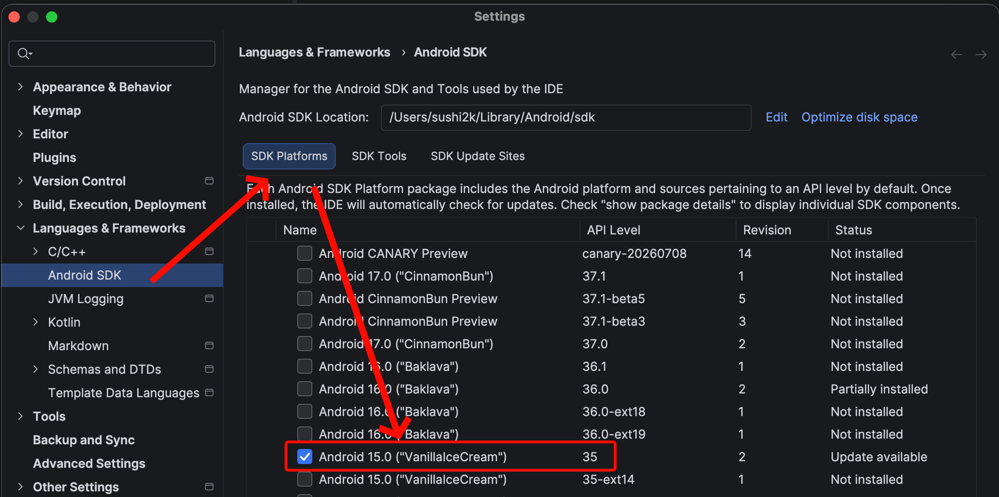
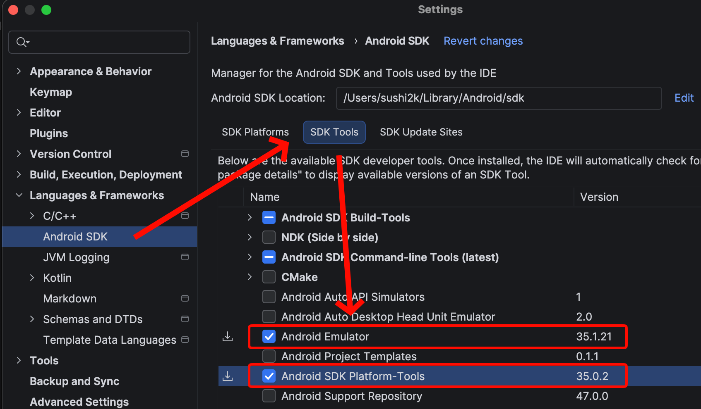
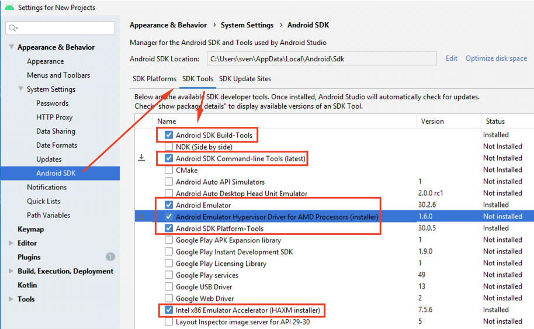
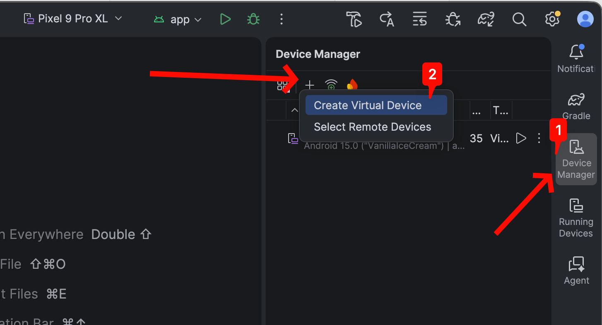
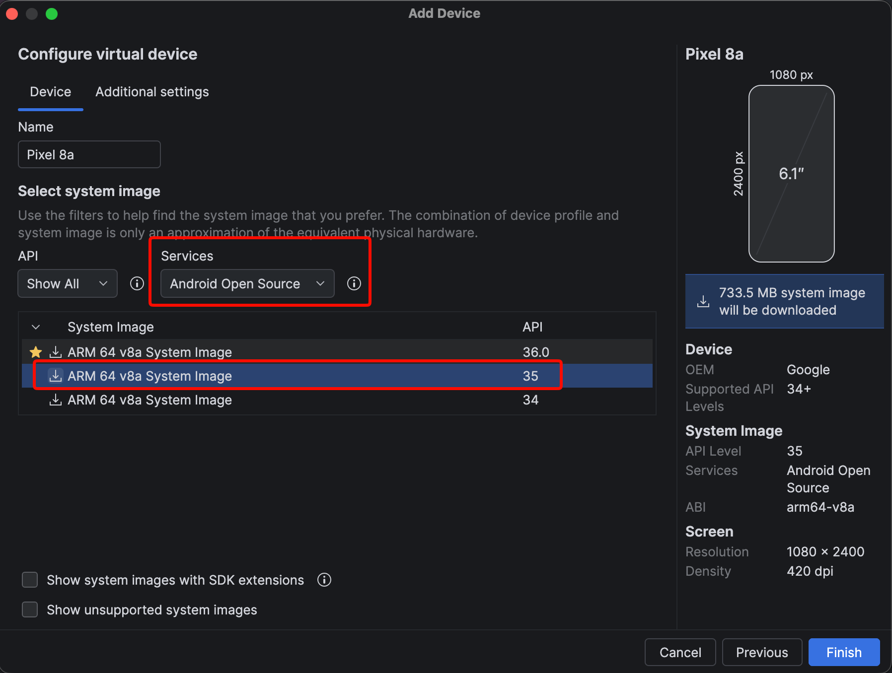
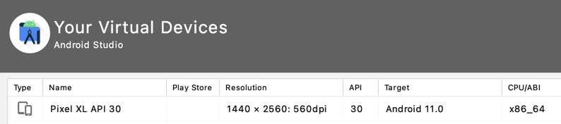
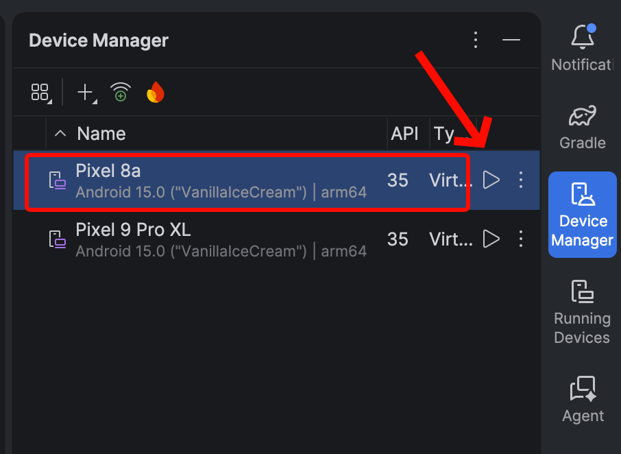

# 02 — Android Studio & Emulator (AVD) with Frida

This is an **optional, standalone guide** for building a **local rooted Android environment** at home: an Android Studio emulator (AVD) plus Frida for dynamic instrumentation.

During the workshop we use **Corellium** for all dynamic analysis (access instructions provided later), so you don't strictly need this. But if you want your own simple rooted device to keep practicing on, follow the steps below to end up with a **pre-rooted Android emulator** with Frida ready to go.

---

## 1. Install Android Studio + SDK

Download and install the latest Android Studio: https://developer.android.com/studio

> Alternatively: Ask for a USB stick with the latest Android Studio versions.

During installation, also install the latest **SDK** and **SDK Tools**. 

On the first launch, open the SDK Manager via **Configure → SDK Manager** (or **Tools → SDK Manager** with a project open).



## 2. Install the SDK Platform

In **SDK Platforms**, select and install the latest stable Android SDK Platform (screenshot shows Android 15 / API 35).



## 3. Install the SDK Tools

In **SDK Tools**, make sure these are selected and installed:

- Android SDK Build-Tools
- Android SDK Command-line Tools
- Android Emulator
- Android SDK Platform-Tools

**macOS**



**Windows**



## 4. Create the AVD (pre-rooted)

In Android Studio, go to **Tools → Device Manager → Create Virtual Device**. A new window will show in Android Studio on the right side. Click on "Device Manager" and "Create Virtual Device".



1. Select **Pixel 8a** → **Next**.
2. Download and select the **plain `Android Open Source System Image` (API 35)** image (**not** the *Google APIs* and **not** the *Google Play* variant as they are not pre-rooted.)
3. **Next → Finish.**



You should now see the device in your list:



Start the AVD and you are done with the Android Studio setup:



## 5. Frida on the device (frida-server)

`frida-server` binaries (v17.16.0) are bundled in this repo under [`frida-server/`](./frida-server).
Unzip the one matching your emulator architecture:

- arm64 processor, like MacBooks (M1/M2/M3/M4): [`frida-server/frida-server-17.16.0-android-arm64.zip`](./frida-server/frida-server-17.16.0-android-arm64.zip)
- x86_64 processor, like many Windows/Linux hosts: [`frida-server/frida-server-17.16.0-android-x86_64.zip`](./frida-server/frida-server-17.16.0-android-x86_64.zip)

Official releases (source of these binaries): https://github.com/frida/frida/releases/tag/17.16.0

With the AVD running, push the binary to the device and start it. The commands below use the **arm64** binary — if you unzipped the x86_64 one, swap the filename accordingly.

```bash
# Restart adb as root (works on the pre-rooted AOSP emulator image)
$ adb root

# Push the unzipped binary to the device
$ adb push frida-server-17.16.0-android-arm64 /data/local/tmp/frida-server

# Make it executable
$ adb shell "chmod 755 /data/local/tmp/frida-server"

# Start frida-server — leave this terminal running
$ adb shell "/data/local/tmp/frida-server &"
```

Verify from your host that Frida can reach the device (this needs `frida-tools` from step 6):

```bash
$ frida-ps -U
```

A list of running processes means `frida-server` is up and reachable.

## 6. Frida on your host (dynamic instrumentation)

- Install: https://frida.re/docs/installation/
- Android setup: https://frida.re/docs/android/

The version on your host **must match** the Frida-Server. Install `frida-tools`:

```bash
$ pip install frida-tools==17.16.0
```
